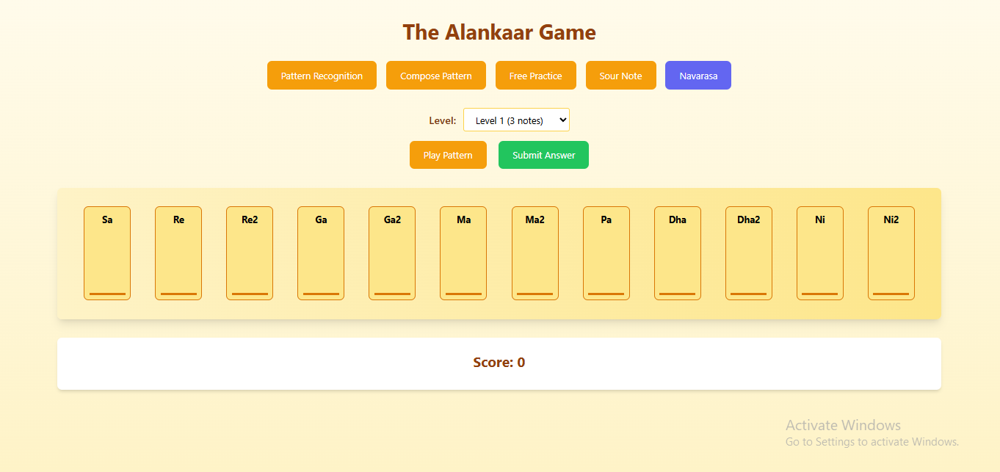

# 🎵 Music Buddy – Gamified Indian Classical Music Learning App

## 📌 Problem Statement

- ❌ **Lack of digital learning platforms** tailored for Indian classical music, especially Tamil Isai.
- 🎯 Most existing apps (80%) cater to **Western music traditions**.
- 🧭 Learners struggle with **pitch (swara) and rhythm (tala) recognition and correction**.
- 🧒 Younger generations find traditional methods **less engaging**, leading to decreased interest in Tamil Isai.
- 📉 Limited access to music teachers in non-urban areas.

> 📊 **Stats:**  
> - 30% YoY growth in online learning post-COVID.  
> - Very few platforms focus on **Indian classical music**.

---

## 💡 Our Solution – Music Buddy

An **interactive, gamified mobile platform** designed to make learning Tamil Isai fun, engaging, and accessible to everyone.

### 🔑 Key Features

- 🎮 **Gamification of Music Learning** – Missions, rewards, progression system.
- 🎙️ **Voice-to-Swara Recognition** – Real-time singing feedback.
- 🎼 **Emotion & Raga Matching Puzzle Game** – Understand the emotional depth of ragas.
- 📚 **Structured Curriculum** – Lessons, raga-based quizzes, and exercises.
- 🌍 **Multilingual Support** – Especially Tamil, for cultural preservation.

---

## 🛠️ Tech Stack

| Layer        | Technology                       |
|--------------|----------------------------------|
| 🎨 Frontend   | HTML, CSS, JavaScript             |
| 🔧 Backend    | Flask (Python)                   |
| 🎵 Audio Tools| Librosa, Compiam (pitch tracking) |
| 📈 Scale      | Pilot: 50–100 users → Target: 10,000+ |

---

## 📱 Prototype Screenshot

---

## 🔗 Live Demo / Render Link

👉 [Click here to view the prototype]([https://your-render-link.com)](https://music-buddy-the-alankaar.onrender.com/)

---
